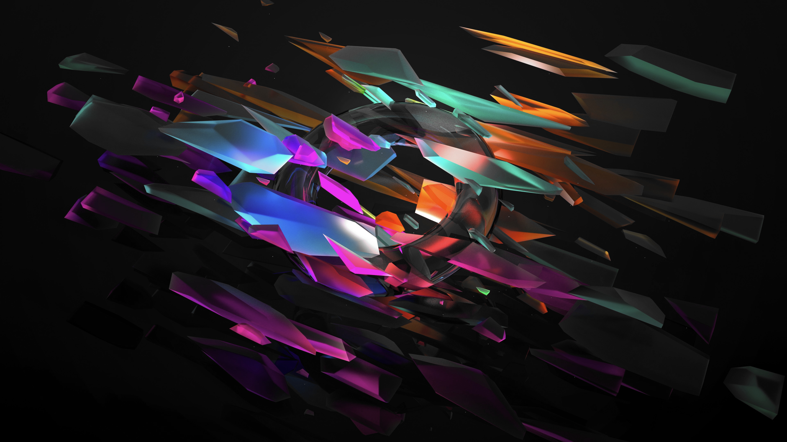

# Omarchy Event Horizon Theme

A warm, vibrant dark theme for Omarchy using the Horizon Dark color scheme with rich corals, teals, and soft peachy tones.

## Preview


## Install

Use the Omarchy theme installer:

```bash
omarchy-theme-install https://github.com/oldjobobo/omarchy-event-horizon-theme
```

## What's included

- Hyprland rules and opacity tuning (`hyprland.conf`)
- Hyprlock styling (`hyprlock.conf`)
- Waybar colors (`waybar.css`, `waybar-theme`)
- Terminals: Alacritty (`alacritty.toml`), Kitty (`kitty.conf`), Ghostty (`ghostty.conf`)
- Shell/tools: Fish colors (`colors.toml`), Walker (`walker.css`)
- Apps/UI: GTK (`gtk.css`), Chromium (`chromium.theme`), Wofi (`wofi.css`)
- System tools: btop (`btop.theme`), cava (`cava-theme`), mako (`mako.ini`), SwayOSD (`swayosd.css`)
- Extras: Vencord (`vencord.theme.css`), Zed (`aether.zed.json`, `aether.override.css`), Warp (`warp.yaml`), Icons (`icons.theme`)

## Wallpapers

<table>
  <tr>
    <td></td>
    <td></td>
    <td></td>
  </tr>
  <tr>
    <td></td>
    <td></td>
    <td></td>
  </tr>
</table>

## Requirements

- A Hyprland-based desktop environment
- Compatible terminals (Alacritty, Kitty, or Ghostty)
- Waybar for the status bar

## Notes

- Transparency and opacity effects are tuned for a modern, layered look
- Multiple wallpaper options included

## Attribution

- Based on the [Horizon Dark](https://horizontheme.com/) color scheme
- Wallpapers sourced from various digital art collections
