# Omarchy Event Horizon Theme

Event Horizon brings the canonical Horizon Terminal Dark palette into a deep-space Omarchy desktop: graphite-black surfaces, plasma cyan, aurora green, coral warnings, and nebula pink. The Quattro shell and Hyprland share one six-stop horizon gradient, while translucent terminals keep the wallpaper field visible behind the work.

## Preview


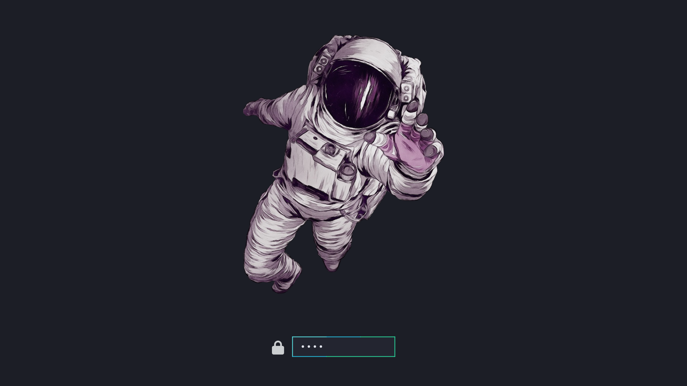

## Install

```bash
omarchy theme install https://github.com/OldJobobo/omarchy-event-horizon-theme.git
```

## What’s Included

- Native Omarchy Quattro surfaces through `shell.toml` and `hyprland.lua`
- Canonical Horizon Terminal Dark roles with an authored Base24 extension
- Coordinated blur, transparency, borders, gaps, and motion
- Optional Aether/THPM integrations for Neovim, Zed, GTK, and supported desktop applications
- Custom Vencord, btop, terminal, launcher, notification, OSD, and lock styling
- Omarchy 3.8 compatibility through `hyprland.conf`, Waybar, Walker, Mako, SwayOSD, and Hyprlock files
- Automatic Quattro-generated themes for Claude, Helix, Pi, Obsidian, VS Code-family editors, keyboard lighting, and the share picker

The portable palette is available as [`horizon-terminal-dark-extended-base24.yaml`](horizon-terminal-dark-extended-base24.yaml). Slots `base00`–`base0F` preserve Horizon Terminal Dark; `base10`–`base17` extend it with darker surfaces and dedicated bright terminal slots.

## Wallpapers

<table>
  <tr>
    <td>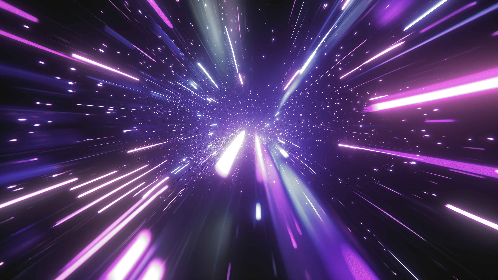</td>
    <td>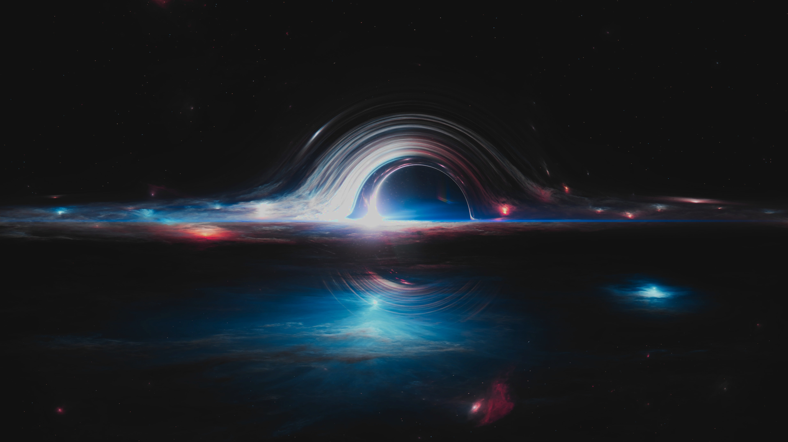</td>
    <td>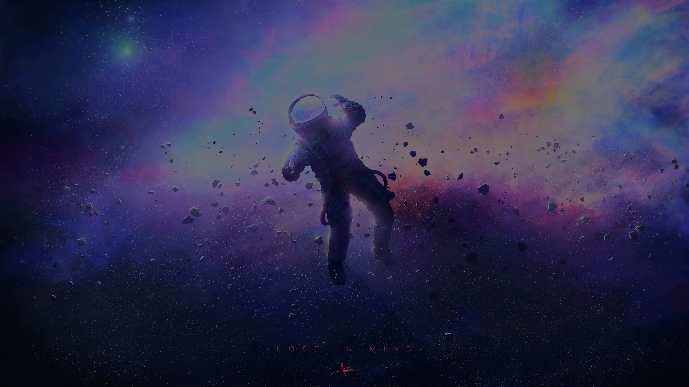</td>
  </tr>
  <tr>
    <td>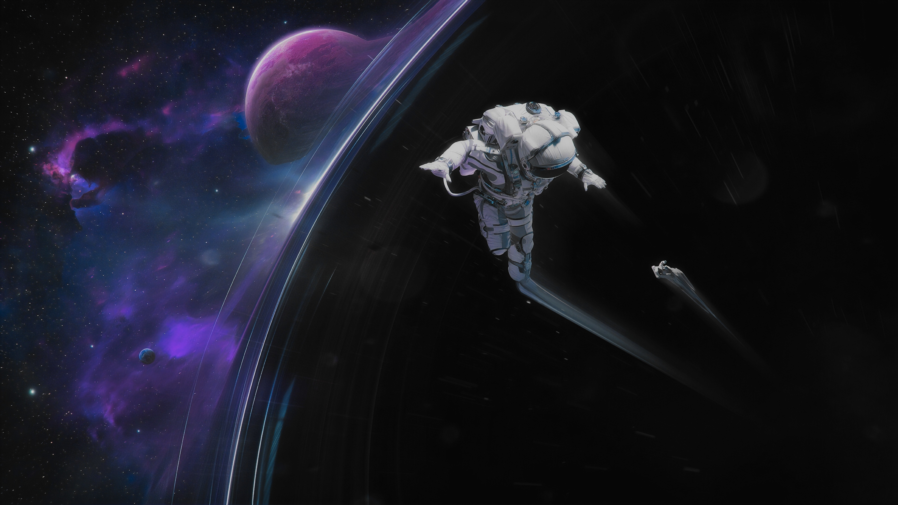</td>
    <td>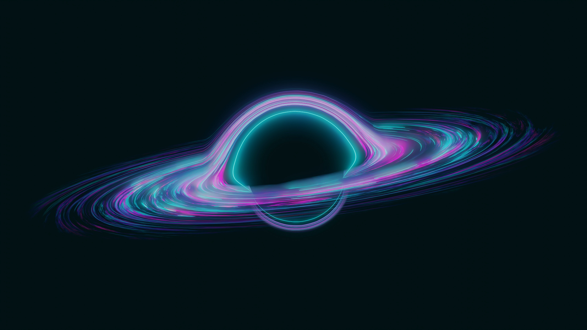</td>
    <td>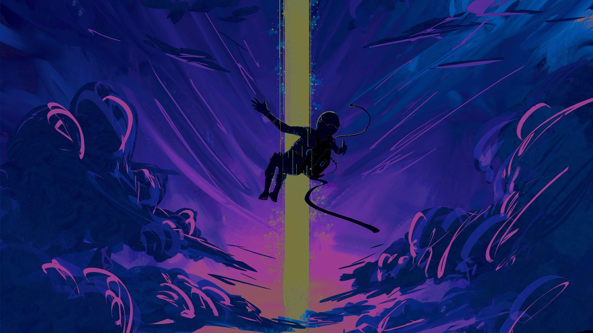</td>
  </tr>
  <tr>
    <td>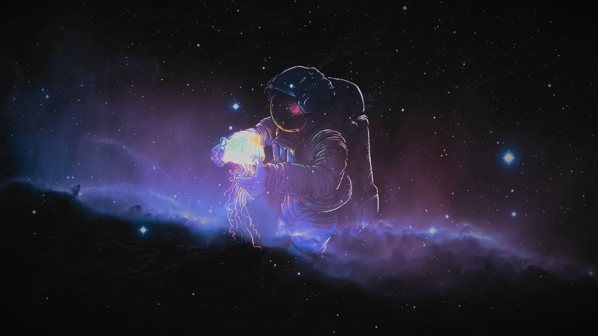</td>
    <td>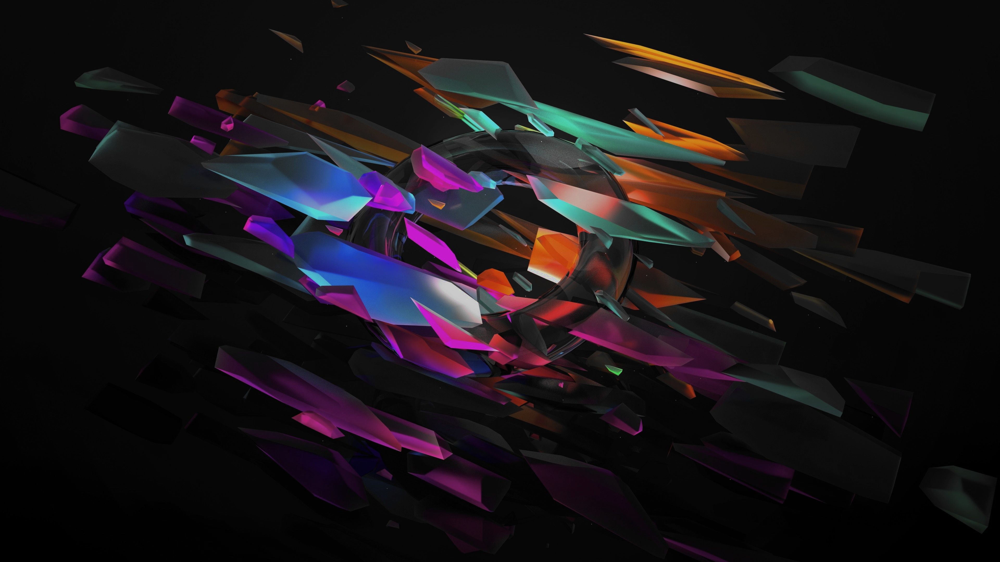</td>
    <td>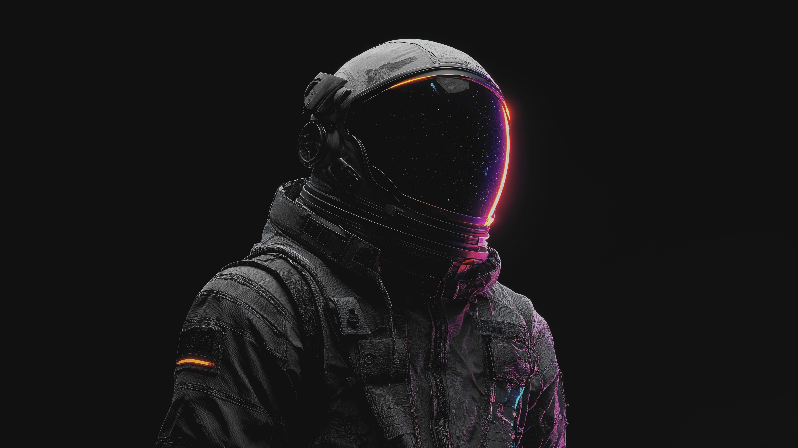</td>
  </tr>
  <tr>
    <td>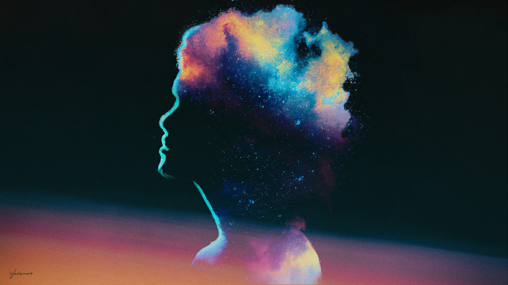</td>
  </tr>
</table>

Animated extras are also bundled in `backgrounds/`. Omarchy’s native background picker currently selects still images; MP4 and WebM files require a compatible external wallpaper workflow.

## Notes

- Terminal opacity is set to `0.45` in the retained custom terminal overrides.
- Quattro generates routine application themes from `colors.toml`; generated boilerplate is intentionally not committed.
- `waybar.css`, `walker.css`, `mako.ini`, `swayosd.css`, `hyprlock.conf`, and `wofi.css` are retained for older Omarchy installations and compatible external setups.
- Aether-specific files require the compatible Aether/THPM integration; they are not native Omarchy application hooks.

## Attribution

- Horizon Terminal Dark by [Michaël Ball](https://github.com/michael-ball/base16-horizon-scheme), based on Jonathan Olaleye’s Horizon theme
- Base24 extension by OldJobobo
- Animation work credited to [@N1R4](https://github.com/nirabyte)
- Waybar compatibility styling based on work by [@N1R4](https://github.com/nirabyte)
- Wallpapers collected from credited digital-art sources where available
